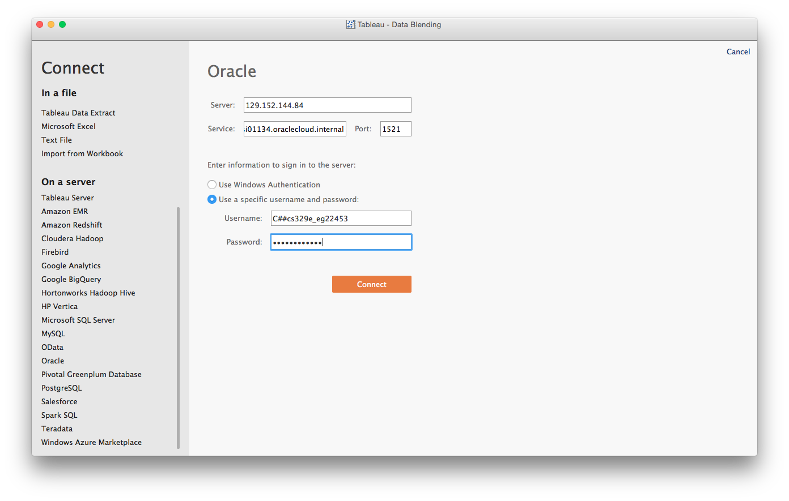
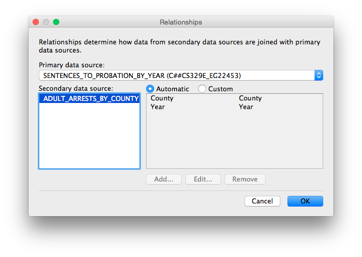
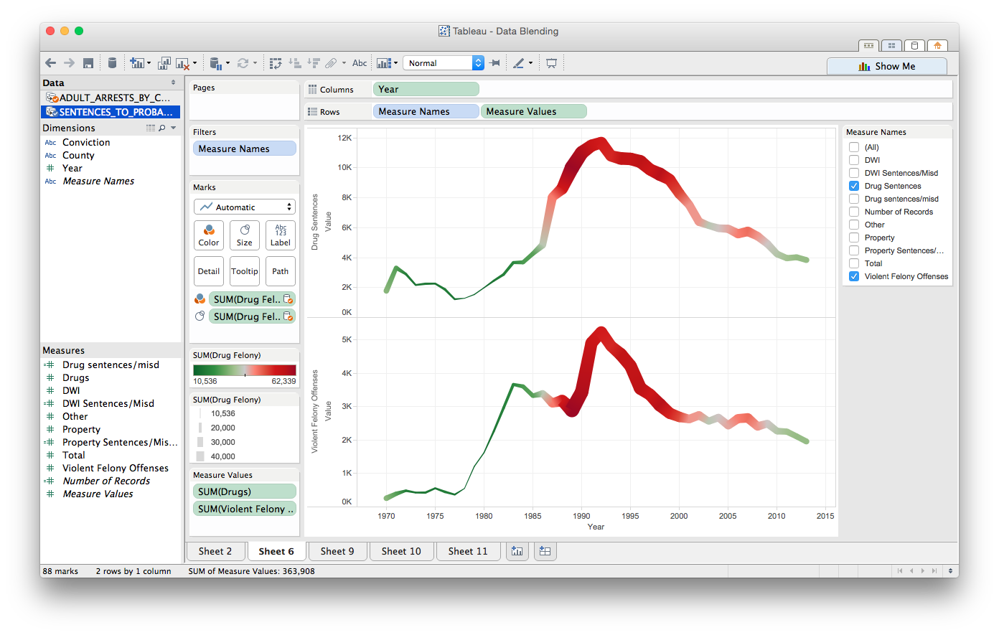
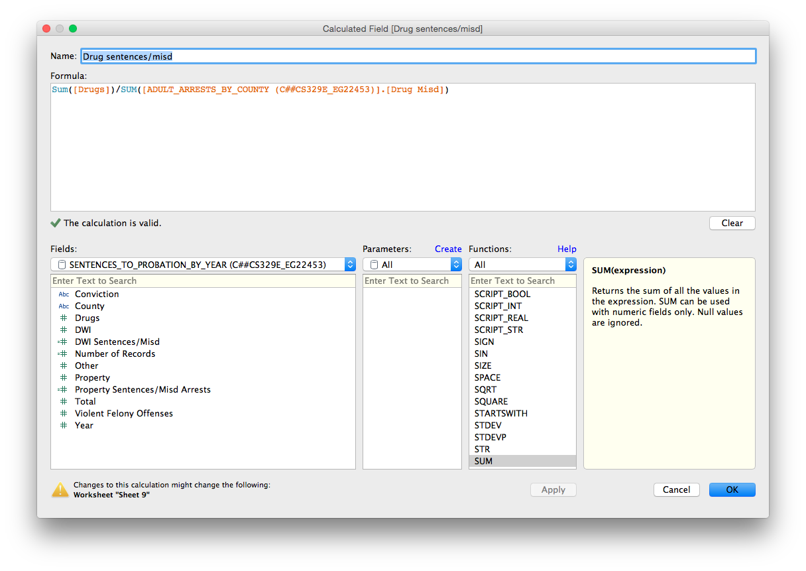
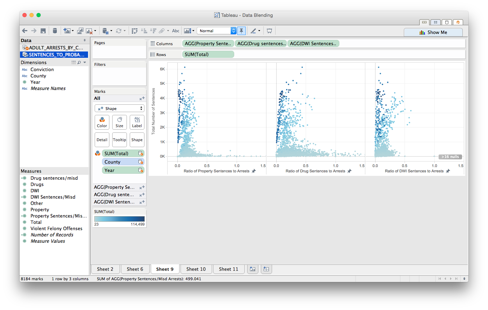
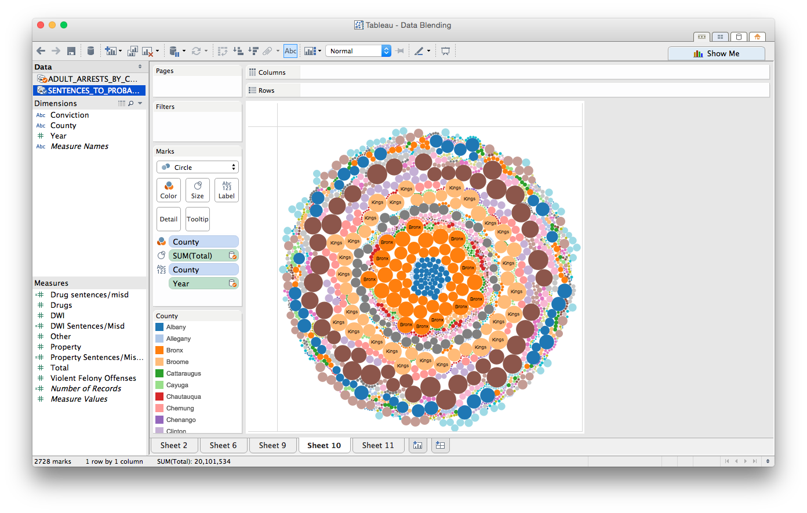
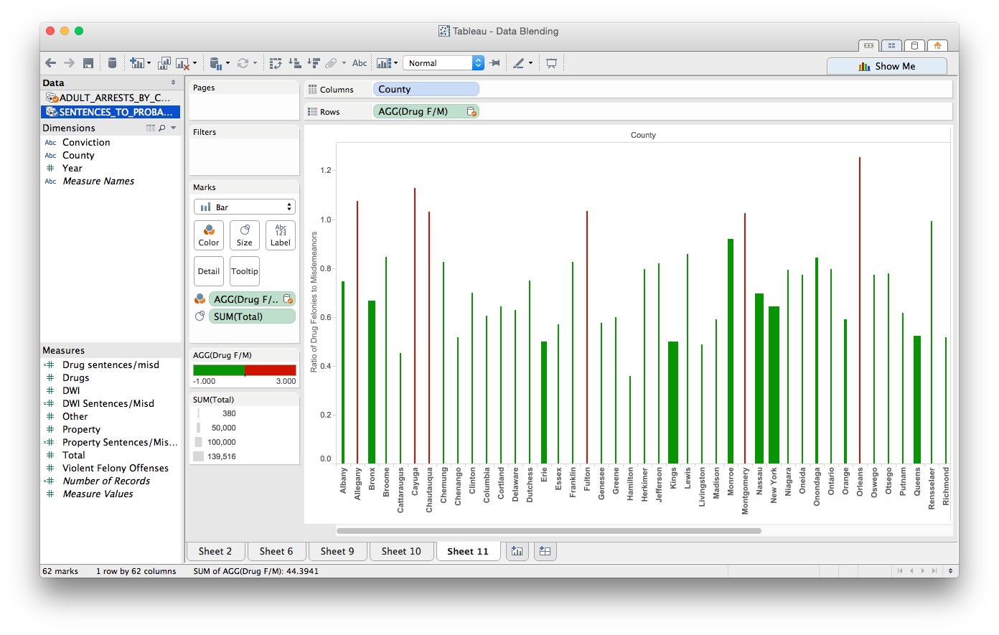
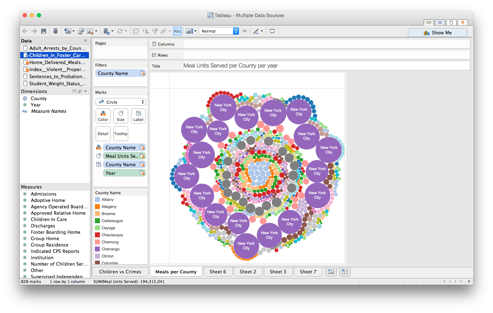
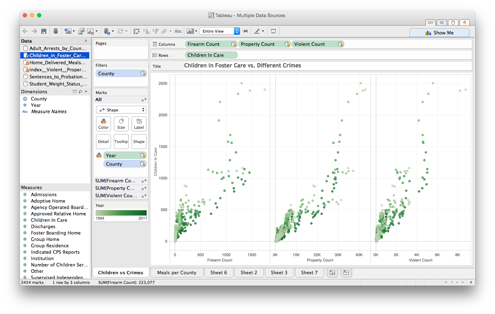

CS 329E Data Visualization - DV_FinalProject
===
**For our final project we incorpate multiple data sets from the New York State official census database (focusing on crime rates and student obesity) and produce interesting visualizations/data operations using the skills we have learned this semester.**

**Authors: Bruno De Hoyos (bd8739), Estevan Garza (eg22453)**


###Importing data


We begin by importing some useful libraries:

```{r, warning=FALSE}
source("../01 Data/lib.R", max.deparse.length=1e3)
```

We now begin building our data frames. We build the data frames through the data.frame() function, and pass to it a URL to an OracleCloud server with an appropriate SQL query. In this case we query the tables “TYPE_CRIMES_BY_COUNTY”, "SENTENCES_TO_PROBATION_BY_YEAR","ADULT_ARRESTS_BY_COUNTY", and "weight3"  which we have already imported into the Oracle database, and and rename the dataframes 'dft', 'dfs',  and 'dfr' respectively.

```{r, warning=FALSE}
source("../01 Data/CrimeDataFrames.R", echo=TRUE, max.deparse.length=1e3)
source("../01 Data/StudentWeightDataFrame.R", echo=TRUE, max.deparse.length=1e3)
```

We then display the 'head' of the data frames to ensure all the data was loaded in properly.

```{r, warning=FALSE}
source("../01 Data/DataFramShow.R", echo=TRUE, max.deparse.length=1e3)
```

###Joining data frames:

Now that we have the three tables loaded into Rstudio, we can now join the tables. We join all three tables by first joining any two tables based on the commmon 'COUNTY' and 'YEAR' columns, placing that table into a temporary data frame, and then joining the temporary data frame with the third table. We do this operation twice, once for a full-join, and another time for an inner-join. We also make use of the complete.cases function for the final tables in order to remove any NA values in rows. We also convert the types of some of the columns to the numerical format, using the as.numeric() function, to make faciliate plotting this data.

```{r, warning=FALSE}
source("../01 Data/CrimeDataFrameJoin.R", echo=TRUE, max.deparse.length=1e3)

```

###Data Wrangling:

The next step in the project is to start doing some data wrangling. The first wrangling procedure involves filtering out the top 50th percentile of the data with respect to DWI misdemeanors.

```{r}
source("../02 Data Wrangling/Wrangle1.R", echo = TRUE, max.deparse.length=1e3)
```

The second wrangling procedure makes use of the mutate function and adds a new column to the joined tables representing the sum of Property, Violence, and Firearm crime rates in each New York county.

```{r}
source("../02 Data Wrangling/Wrangle2.R", echo = TRUE, max.deparse.length=1e3)
```

The next and most complex wrangling procedure involves selecting various crime related columns (which including different variations of felony and misdemeanor crimes), groups them by year, and summarises the mean for each crime column. We utilize the melt function introduced at the beginning of the semester in order to stack the respective column data on top of each other, which all share the YEAR column.

```{r}
source("../02 Data Wrangling/Wrangle3.R", echo = TRUE, max.deparse.length=1e3)
```

Now we implement the first of our data wrangling for the student obesity table and through use of the pipe operators, filter, mutate and cumulative distribution functions, produce a new data frame with a new variable, "owobpct". This variable ranks each individual school district level (not the DISTRICT_TOTAL numbers however which have been filtered out using the != operator) in orders of percentiles concerning overweight OR obese students.

```{r}
source("../02 Data Wrangling/student_wrangle1.R", echo = TRUE, max.deparse.length=1e3)
```


The next step of this data wrangling process expands on the first by filtering the table further. In this data frame the STATEWIDE region is not included and the top ten percentile of districts with the most overweight or obese students are not included.

```{r}
source("../02 Data Wrangling/student_wrangle2.R", echo = TRUE, max.deparse.length=1e3)
```


The final wrangling procedure involves filtering out the top ten percentile of 'Number of Overweight or Obese', region 'Statewide', and grade level 'District total'. Then we use a group_by function that groups 'City' and ‘Region' together and obtains the mean value of 'Percent Overweight or Obese' based on the groupings.

```{r}
source("../02 Data Wrangling/student_wrangle3.R", echo = TRUE, max.deparse.length=1e3)
```


###Making Some Plots:

Now we start plotting out data using the data wrangling procedures performed above. This first graph shows the number of DWI misdemeanor arrests against county population, and then facet-wraps and color codes the data with respect to year. We then apply a linear fit to all of the plots, in order to see the general increasing trend in DWI misdemeanors with increase in county population for every year.

```{r, warning=F}
source("../03 Visualizations/Plot1.R", echo = TRUE, max.deparse.length=1e3)
```

Our second plot makes use of the second wrangling procedure by plotting the density distribution of the sum of property, violence, and firearm crime rates. Notice that this plot is done on a semi-log scale along the x-axis, in order to better show the distribution which would otherwise be difficult to see using an ordinar scale. There are different distribution curves pertaining to each year of data, and it is color-coded per year in order to see the time-dependent trend. Overall, we see that this data follows a normal distribution every year. From this, we see that the mean of the sum of all of these crime rates decreases as time increased (there were less crimes as time progressed, on average), but we also see that the variance of these averages decreased with increasing time, as seen by the taller and narrower distribution curves from recent years.

```{r, warning=F}
source("../03 Visualizations/Plot2.R", echo = TRUE, max.deparse.length=1e3)
```

The third plot obviously is used alongside the most complicated wrangling procedure. With this graph we plot all of the melted averages with respect to year on one plot as points. We then plot a fitted curve line with a gray error width, as well as a dotted linear fitted line. As one can see, we make use of the ggplot functions that make our plots more aesthetically pleasing including things like graph titles, unique fonts and color coded regression lines. The linear fitted lines help us see that, despite the fluctuations seen in the data, all of the crime types seem to decrease with time. This may be an indication that New York keeps getting more safe every year, with the decreasing trends in almost every column.

```{r, warning=F}
source("../03 Visualizations/Plot3.R", echo = TRUE, max.deparse.length=1e3)
```


Next we plot a geometric point graph that shows the relationship between the number of obese children and number of overweight children in both elementary and middle/high schools.

```{r, warning=F}
source("../03 Visualizations/plot1student.R", echo = TRUE, max.deparse.length=1e3)
```

It's interesting to see that elementary schools, although on average having less of each, have more more "outliers" in the data set. This could be attributed to the restirictions of school sports in elemenary schools or some other unobservable factor(s).

```{r}
source("../03 Visualizations/plot3student.R", echo = TRUE, max.deparse.length=1e3)
```

Plotting the individal lat and long coordinates on point graph we are able to see that the data set was taken from all over the state of New York in a relatively thourough study. The outline of each graph is the obvious form of the state itself. Furthermore we are able to deduce from the graph(s) 2 things.

1. Although being overweight or obese was generally seen in all parts of the state there was still a correlation with higher percentages( >.4) in the norther half of New York

2. Between 2012 and 2013 the states' school districts saw a significant decrease in the amount of overweight or obese students.

##Using Tableau

###Importing data to Tableau

We begin by importing the data to Tableau. Since both of our data tables were previously stored in an Oracle database during an earlier project, we use Tableau's "Connect to Data" wizard by selecting Oracle in the sidebar. Our data can be accessed by using the following credentials:

```
Server: 129.152.144.84
Service: ORCL.usuniversi01134.oraclecloud.internal
Port: 1521
Username: C##cs329e_eg22453
Password: orcl_eg22453
```



We do this process two separate times under the same workbook, in order to import the two tables separately and avoid "joining" them.

##Adding Relationships

Once our data is loaded into Tableau, we must add relationships to the data tables to ensure Tableau is able to use them properly. To do this, we go to `Data >> Edit Relationships...` and add the appropriate relationship that links the data together. For our project, our data was joined by the `County` and `Year` columns, as shown below.

 


##Data Blending

####Blend 1

We are now ready to create some interesting visualizations. For our first image, we wanted to see how drug and violence-relatated sentences correlated with drug felonies. We did this using a simple line graph, plotting `year` on the x-axis and the two measures of interest (`Drug Sentences`, `Violent Felony Sentences`) on the y-axis. In order to make use of the second data table, we adjusted the size and color of the graphs according to the number of drug arrests. It is clear from the graph colors and the upper graph, that with an increase in drug arrests and sentences, there was a definite spike in the number of violent sentences.



####Blend 2

For our second graph, we wanted to see how the ratio of sentences to arrests varied for different types of crimes. In order to do this, we created several calculated fields for drug, DWI, and property crimes. These calculated fields were simply a ratio of the sum of the sentences to the sum of the arrests for each specific crime type, as shown below for the case of drugs. 



With these three calculated ratios (drugs, DWI, and property), we then created plots with these the ratios (x-axis) against the total number of sentences (y-axis) across all crime types, to see if the ratio would change. Surprisingly, we found that the ratio of sentences to arrests was fairly consistent within 0 to 0.5 for these three crime types, regardless if the data point was from a high sentence count (5K), or a low one (50). In order to spice up the data, we colored the points according to the sum of the total number of arrests.




####Blend 3

For our third plot, we decided to visualize crime parameters for all of the different counties in New York. We decided to make a bubble plot, where each county was colored and labeled distinctly. We then sized each bubble according to the total number of arrests in that county for all types of crime. Because each county was given a bubble for each year, coloring by county was useful to see which counties had consistently high (or consistently low) number of arrests across years. It can be seen that some counties, such as Bronx and Kings, were the ones with consistently high number of arrests, whereas some counties are so small that their labels did not even show up.




####Blend 4

For our final plot, we made another calculated field, this time to calculate the ratio of the number of drug felonies to the number of drug misdemeanors, for each county. The calculation was done very similar to the ones under Blend 2, with just a simple division of two sums. We plotted this ratio for all of the different counties using a bar graph, and colored the bars according to their value. If the ratio was over 1, the bars would be red, and anything else would be green. In addition, we adjusted the width of the bars according to the total number of crime sentences for that respective county. Surprisingly, we found that the counties with red bars (that is, more felonies than misdemeanors) were also counties with thin bars (meaning a low number of crime sentences). This seems a little counterintuitive, but there are some exceptions to every case.



##More Data Sources

In order to spice up our data even further, we decided to incorporate data from other databases to our current plots. We added a database on the number of home delivered meals to elderly people in NY, as well as statistics on foster care in NY. The following two plots illustrate this data being blended with some of our previous data sources.

The plot shown below illustrates the number of meals served per county per year for all of the counties in New York. That is, every county gets their own "bubble" for each year, and the bubbles are color coded by counties. It is clear from the data that although New York City is not the most populous county, it delivers the most meals to elderly people year after year.



This next plot show the relationship between different crime counts and the number of children in foster care across different counties for different years. Although there is much spread in the data, it can be seen that there is a rought linear relationship between the different crimes and the children in foster care.


